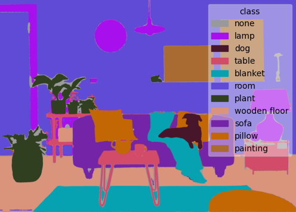

# Per-pixel Features: Mating Segment-Anything with CLIP
This repository aims to generate per-pixel features using pretrained models, [Segment-Anything](https://github.com/facebookresearch/segment-anything) and [CLIP](https://github.com/openai/CLIP). The pixel-aligned features are useful for downstream tasks such as visual grounding and VQA. First, we use the SAM to generate segmetation masks. Then, cropped images are sent into CLIP to extract semantic features. Finally, each pixel will be assigned semantic features according to its associated masks.

Here, we show open-vocabulary segmentation without any training and finetuning.

| Input Image | Segment Segmentation|
| :---: | :---:|
|  | |


## Prepare
1. You may need to install [Segment-Anything](https://github.com/facebookresearch/segment-anything) and [CLIP](https://github.com/openai/CLIP) (or, [OpenCLIP](https://github.com/mlfoundations/open_clip)).
2. Download one of [SAM](https://github.com/facebookresearch/segment-anything#model-checkpoints) checkpoints from the SAM repository.

## Demo
You can generate per-pixel features of an image.
```
python feature_autogenerator.py --image_path {image_path} --output_path {output_path} --output_name {feature_file_name} --checkpoint_dir {checkpoint_dir}
```
Or directly generate segmentation results by the given config file.
```
python segment.py --config_path {config_path}
```

## Acknowledgement
1. [Segment-Anything](https://github.com/facebookresearch/segment-anything)
2. [CLIP](https://github.com/openai/CLIP)
3. [OpenCLIP](https://github.com/mlfoundations/open_clip)

## Citation
If you find this work useful for your research, please consider citing this repo:

```
@misc{mingfengli_seganyclip,
  title={Per-pixel Features: Mating Segment-Anything with CLIP},
  author={Li, Ming-Feng},
  url={https://github.com/justin871030/Segment-Anything-CLIP},
  year={2023}
}
```